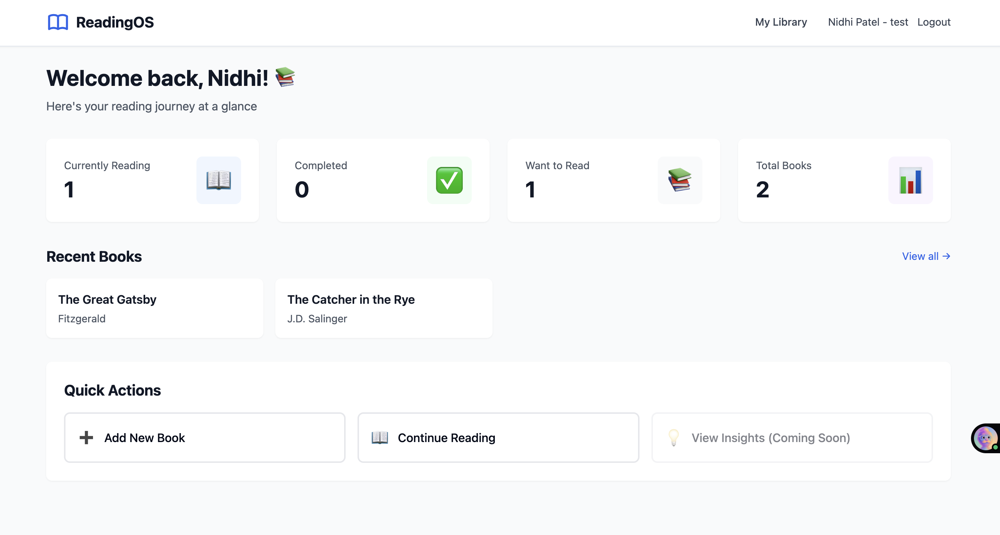
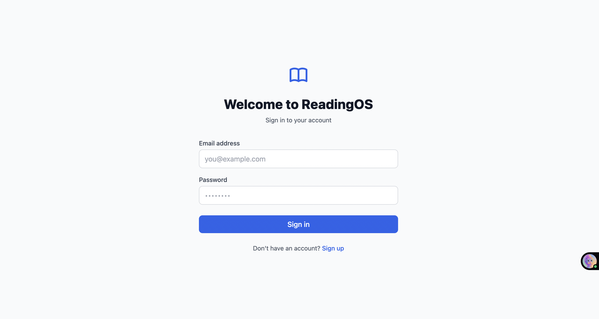
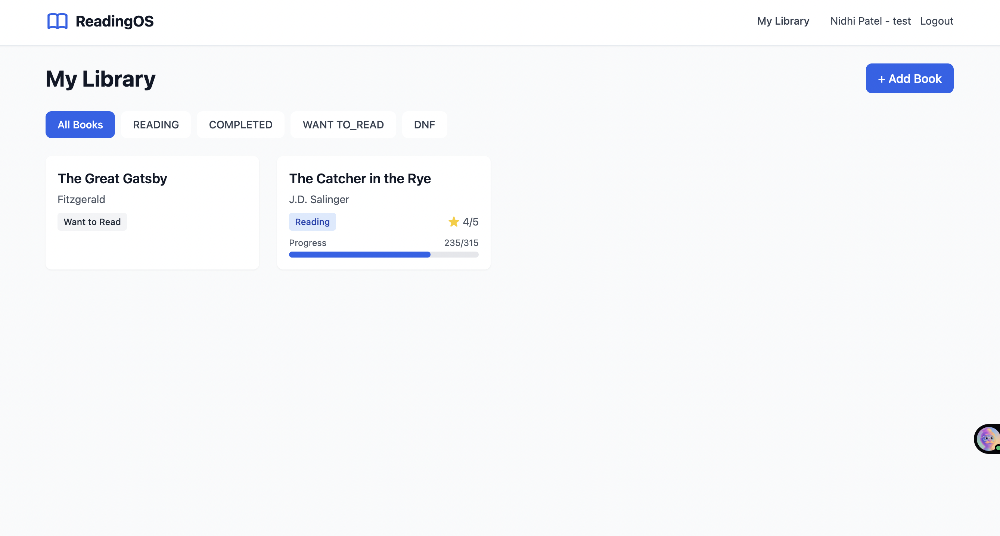

# 📚 ReadingOS

> Your intelligent reading companion - Track your reading journey and engage in AI-powered book discussions.



## 🌟 Overview

ReadingOS is a full-stack web application that helps readers track their reading progress, manage personal libraries, and have meaningful AI-powered discussions about books. Built with modern web technologies and integrated with Groq's Llama 3.3 AI model.

## 🚀 Deployment
**Frontend**: https://readingos-frontend.onrender.com
**Backend**: https://readingos-backend.onrender.com

## ✨ Features

### 📖 Reading Management
- **Personal Library**: Add and organize books with status tracking (Reading, Completed, Want to Read, DNF)
- **Progress Tracking**: Visual progress bars with page-by-page updates
- **Ratings & Reviews**: 5-star rating system with personal notes
- **Smart Filtering**: Filter books by reading status

### 🤖 AI-Powered Discussions
- **Contextual Conversations**: Discuss themes, characters, and ideas with AI that knows your reading progress
- **Intelligent Responses**: AI considers your current page, highlights, and notes to avoid spoilers
- **Natural Dialogue**: Multi-turn conversations that feel natural and insightful

### 📊 Reading Dashboard
- **Statistics Overview**: Track currently reading, completed, and total books
- **Quick Actions**: Fast access to frequently used features
- **Recent Activity**: See your latest reading activity at a glance

### 🎨 Modern UI/UX
- **Responsive Design**: Works seamlessly on desktop, tablet, and mobile
- **Beautiful Interface**: Clean, modern design built with Tailwind CSS
- **Smooth Animations**: Delightful micro-interactions and transitions

## 🛠️ Tech Stack

### Frontend
- **React 18** - UI framework
- **React Router v6** - Client-side routing
- **Tailwind CSS** - Utility-first styling
- **Axios** - HTTP client
- **Vite** - Build tool and dev server

### Backend
- **Node.js** - Runtime environment
- **Express.js** - Web framework
- **PostgreSQL** - Relational database
- **JWT** - Authentication
- **bcrypt** - Password hashing

### AI Integration
- **Groq AI** - LLM API (Llama 3.3)
- **Prompt Engineering** - Context-aware conversations

## 🚀 Getting Started

### Prerequisites
- Node.js v18 or higher
- PostgreSQL 12 or higher
- Groq API key ([Get one free](https://console.groq.com))

### Installation

1. **Clone the repository**
```bash
git clone https://github.com/yourusername/readingos.git
cd readingos
```

2. **Setup Backend**
```bash
cd backend
npm install

# Create PostgreSQL database
createdb readingos

# Configure environment variables
cp .env.example .env
# Edit .env with your database credentials and Groq API key

# Run migrations
npm run migrate

# Start backend server
npm run dev
```

3. **Setup Frontend**
```bash
cd ../frontend
npm install

# Configure environment variables
cp .env.example .env
# Edit .env with your API URL (default: http://localhost:5000/api)

# Start frontend dev server
npm run dev
```

4. **Access the application**
- Frontend: http://localhost:5173
- Backend: http://localhost:5000
- Health Check: http://localhost:5000/health

## 📁 Project Structure

```
readingos/
├── backend/
│   ├── src/
│   │   ├── config/          # Database and environment config
│   │   ├── controllers/     # Request handlers
│   │   ├── middleware/      # Auth and error handling
│   │   ├── routes/          # API endpoints
│   │   ├── services/        # Business logic (AI service)
│   │   └── app.js          # Express app setup
│   ├── migrations/          # Database schema
│   ├── scripts/             # Migration runner
│   └── server.js           # Entry point
│
└── frontend/
    ├── src/
    │   ├── components/      # Reusable UI components
    │   ├── context/         # React Context (Auth)
    │   ├── pages/           # Page components
    │   ├── services/        # API client services
    │   ├── App.jsx         # Main app component
    │   └── main.jsx        # Entry point
    └── public/             # Static assets
```

## 🔐 Environment Variables

### Backend (.env)
```env
PORT=5000
NODE_ENV=development

DB_HOST=localhost
DB_PORT=5432
DB_NAME=readingos
DB_USER=postgres
DB_PASSWORD=your_password

JWT_SECRET=your-secret-key
JWT_EXPIRE=7d

GROQ_API_KEY=your-groq-api-key
GROQ_MODEL=llama-3.3-70b-versatile

FRONTEND_URL=http://localhost:5173
```

### Frontend (.env)
```env
VITE_API_URL=http://localhost:5000/api
```

## 📡 API Endpoints

### Authentication
- `POST /api/auth/register` - Register new user
- `POST /api/auth/login` - Login user
- `GET /api/auth/profile` - Get user profile (protected)

### Library Management
- `GET /api/library` - Get user's books (with optional status filter)
- `POST /api/library/books` - Add book to library
- `GET /api/library/books/:id` - Get book details
- `PATCH /api/library/books/:id` - Update book progress/status
- `DELETE /api/library/books/:id` - Remove book from library

### AI Conversations
- `GET /api/ai/conversations` - Get all conversations
- `POST /api/ai/conversations` - Create new conversation
- `GET /api/ai/conversations/:id` - Get conversation with messages
- `POST /api/ai/conversations/:id/messages` - Send message
- `DELETE /api/ai/conversations/:id` - Delete conversation

## 🏗️ Architecture Highlights

### Database Design
- **Normalized schema** with 5 tables (users, books, user_books, ai_conversations, conversation_messages)
- **Foreign key constraints** with cascade deletes
- **Indexed columns** for optimized queries
- **Unique constraints** to prevent duplicates

### Authentication Flow
- **Password hashing** with bcrypt (10 salt rounds)
- **JWT tokens** with 7-day expiration
- **Protected routes** with middleware validation
- **Automatic token refresh** on 401 errors

### AI Integration Strategy
- **Context building**: Includes book metadata, reading progress, and user notes
- **Conversation threading**: Maintains message history for coherent discussions
- **Error handling**: Graceful fallbacks for API failures
- **Rate limiting**: Respects Groq's free tier limits (14,400 requests/day)

## 🧪 Testing

```bash
# Backend
cd backend
npm test

# Frontend
cd frontend
npm test
```

## 📈 Future Enhancements

- [ ] Reading analytics with charts (books read over time, genre distribution)
- [ ] Book search API integration (Google Books, Open Library)
- [ ] Highlights and annotations
- [ ] Reading goals and challenges
- [ ] Social features (share books, reading groups)
- [ ] Dark mode
- [ ] PWA capabilities for offline access
- [ ] Export data as PDF/CSV

## 🤝 Contributing

Contributions are welcome! Please feel free to submit a Pull Request.

1. Fork the repository
2. Create your feature branch (`git checkout -b feature/AmazingFeature`)
3. Commit your changes (`git commit -m 'Add some AmazingFeature'`)
4. Push to the branch (`git push origin feature/AmazingFeature`)
5. Open a Pull Request

## 📝 License

This project is licensed under the MIT License - see the [LICENSE](LICENSE) file for details.

## 👤 Author

**Nidhi Patel**
- GitHub: [@Nidhi233](https://github.com/Nidhi233)
- LinkedIn: [Nidhi Patel](https://www.linkedin.com/in/nidhi-patel-2595a1226/)

## 🙏 Acknowledgments

- [Groq](https://groq.com) for providing free access to Llama 3.3 API
- [Tailwind CSS](https://tailwindcss.com) for the amazing CSS framework
- [React](https://react.dev) team for the fantastic library

## 📸 Screenshots

### Login


### Dashboard


### Library View


### AI Chat


### Book Detail

